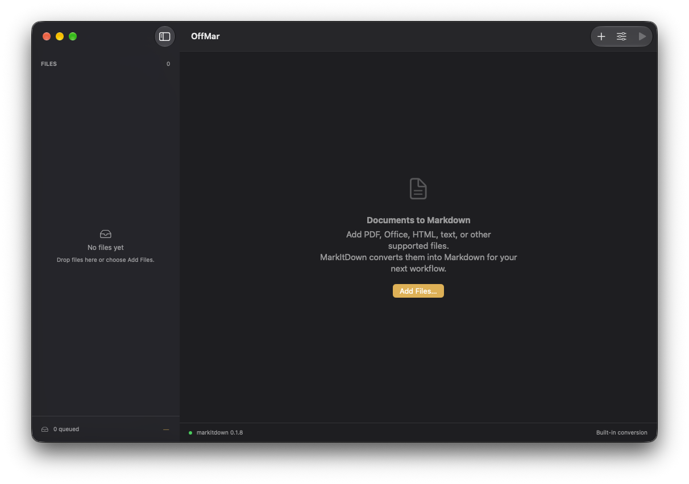

<h1 align="center">OffMar</h1>

<p align="center">
  
  
  
  
</p>



A native macOS utility for the separately installed [Microsoft MarkItDown CLI](https://github.com/microsoft/markitdown).

> [!IMPORTANT]
> **OffMar is an independent, unofficial graphical interface for MarkItDown.** It is not a Microsoft product and is not affiliated with, developed, maintained, sponsored, or endorsed by Microsoft or the MarkItDown team. MarkItDown is a separate project maintained by Microsoft and must be installed independently. References to Microsoft and MarkItDown identify the CLI that OffMar uses; they do not imply any official association.

## Build

Requires macOS 15+, Xcode, and XcodeGen. Use the Makefile from the project root:

```sh
make build  # Generate the Xcode project and compile
make        # Compile and open the app (same as make all)
make install # Compile and copy OffMar.app to /Applications
make uninstall # Remove OffMar.app from /Applications
make clean  # Remove build products and the project's Xcode cache
```

Debug is the default configuration. For a release build, run
`make build CONFIGURATION=Release`. The Makefile runs XcodeGen automatically;
there is no need to generate the project or invoke XcodeBuild manually.

## Install MarkItDown separately

```sh
pip install 'markitdown[all]'
markitdown --version
```

A virtual environment or `pipx` / `uv tool` installation is also suitable. In
OffMar Settings, choose the full path to the executable if automatic detection
does not find it. OffMar checks `~/.local/bin`, Homebrew, and inherited PATH entries.
It never installs or updates the CLI for you.

## Use

Add or drop regular files, adjust Options if needed, then choose Convert Queue
(Cmd+R). Select a result to inspect the raw Markdown, copy it, or save a `.md` file.
The queue is sequential. Cancellation stops the current CLI process and leaves
remaining files queued. Queue Again reprocesses a completed, failed, or cancelled
file. Files and conversion results are kept in memory only; the executable path
is persisted locally.

Plugins are opt-in. Azure modes require a configured Azure environment and endpoint;
they send documents to cloud services and can be billable. Built-in converters
are not a guarantee of offline operation for every format or plugin. Supported
formats and extraction quality depend on installed MarkItDown extras; scanned PDF
OCR is not promised by the default local conversion.

This personal-use build intentionally does not enable App Sandbox, since it runs
an external CLI and reads user-selected local files. It does not bundle Python,
MarkItDown, authentication tools, or credentials. CLI diagnostics are shown as
reported by MarkItDown and may contain paths or service messages.

## Tests

```sh
make test
```

## License

OffMar is licensed under the [MIT License](LICENSE).
Third-party dependencies and vendored skills remain subject to their respective licenses.
